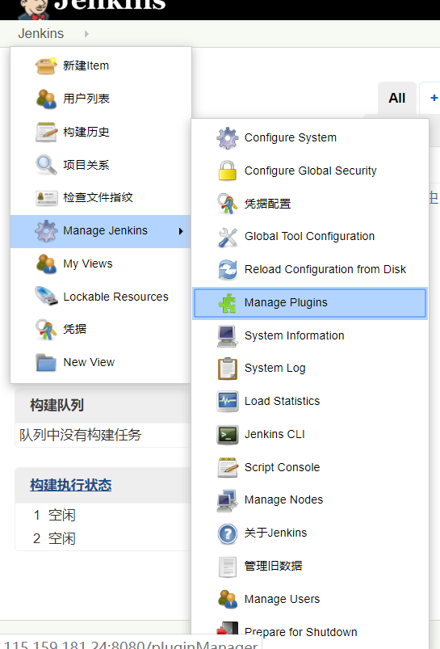

## Jenkins+Inno Setup 自动化部署

### 一、安装流程

##### 1.安装Jenkins

去Jenkins官网下载 适合windows环境的安装包，一键式安装即可，安装完成以后会提示安装插件，就选项系统推荐的安装就行了


**然后会发现大部分的插件安装会失败**！！！这个问题只需要修改一下插件镜像地址，把它改成国内的镜像地址即可


点击Manager Jenkins=>Manager Plugins=>高级  

在升级站点 的url文本框中输入:https://mirrors.tuna.tsinghua.edu.cn/jenkins/updates/update-center.json




然后重新安装插件即可


其他的插件，还需要安装 **MsBuild Plugin**   msbuild是用来做c++编译的

我是用gitlab来做源代码管理的，所以还需要安装 **Gitlab Authentication plugin**，这个插件是用来来做gitlab账户校验的

##### 2.安装Inno Setup

官网下载一键安装即可，关于它的是用方法不难，就不多做说明了，查看这个[链接](https://blog.csdn.net/lailai186/article/details/11804359)

 

##### 3.安装vs2017 

最开始 因为需要msbuild的编译，所以直接安装的是Vs 2015 build tool，经过多次测试发现不行。最后就直接安装了完整的vs2017，其实安装其他版本的vs版本也是可以的，根据代码的需求来决定。安装vs2017的时候有几个必要组件要勾选: **windows xp支持、8.1 Sdk 、vc++ 2015.3 v14工具集**


### 二、开始配置

##### 1.新建项目

新建item->FreeStyle project

##### 2.填写项目信息

在General->描述中  填写项目描述

##### 3.添加代码git地址

在源码管理->git  Repository URL 填写git地址，如果是私有的项目 需要在 Credentials 中添加 账户信息，

在 Branch Specifier (blank for 'any') 中填写  分支


##### 4.填写编译指令

在构建一栏中  MSBuild Version 填写 msbuild版本， MSBuild Build File 是要编译的项目名称，Command Line Arguments 是编译参数


我这里只编译一个项目(xxx.vcxproj) ，如果是要编译多个项目的话(xx.sln) 需要在 编译参数一栏重添加 /m。具体的可以参数msbuild.exe 编译参数

到目前为止经过多次测试可以把git上面的代码正常clone到本地 并且编译正常，接下来就是 把编译的exe 打包成Setup


##### 5.添加打包脚本

通过Inno Setup 可以创建一个xxx.iss的脚本，该脚本就是用来打包用的，InnoSetup 安装完成以后 有一个 iscc.exe 的程序，这个程序就是可以用来执行xx.iss的脚本。

添加InnoSetup的安装目录到环境变量，注意：**一定要添加到全局环境变量，而不是当前用户的环境变量并且Jenkins 要重启**

二者缺一不可不然的话Jenkins执行脚本的时候回提示

```
'iscc' 不是内部或外部命令，也不是可运行的程序或批处理文件。
```

 然后点击 **增加构建步骤** 选择 **Excute Windows batch command**

```
xcopy CarHelper\Release\Carhelper.exe ./Y /R /F
xcopy CarHelper\carhelperTest.iss ./Y /R /F
iscc carhelperTest.iss
```

 

就这样配置完成了，最后到项目列表页面 点击**Build** 就行了，成果或者失败 都会在Jenkins的控制台里面看到

